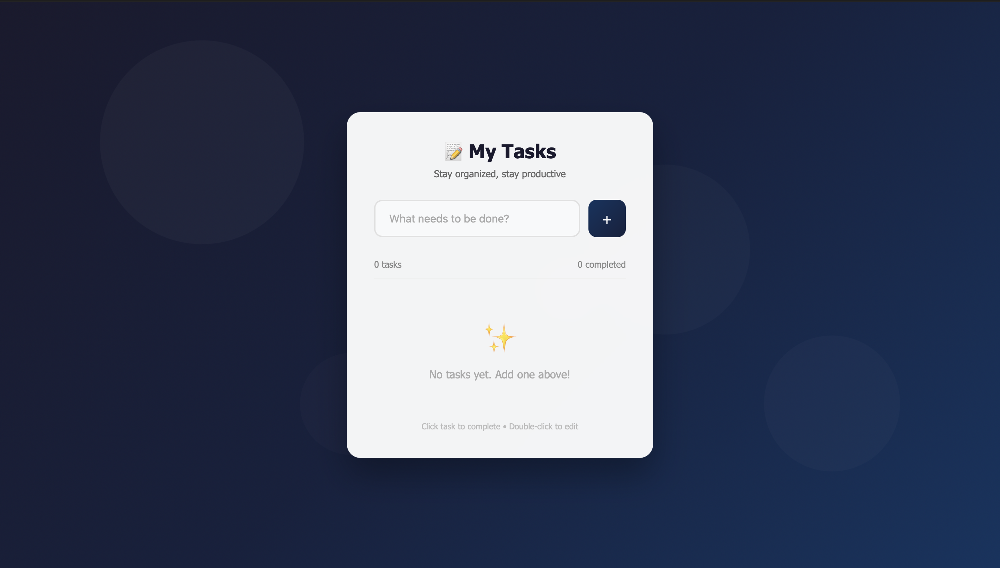

# 📝 To-Do List Web App

A simple and responsive To-Do List web application built using HTML, CSS, and JavaScript. This project is designed to help users manage daily tasks efficiently through a clean, minimal, and intuitive interface.

---

## 📸 Project Preview



---

## 🚀 Features
- Add new tasks
- Edit existing tasks
- Mark tasks as completed
- Clean and responsive user interface
- Beginner-friendly and easy-to-understand JavaScript logic

---

## 🛠️ Technologies Used
HTML5 is used for structuring the content, CSS3 for styling and layout, and Vanilla JavaScript for handling the application logic and interactivity.

---

## 📂 Project Files
The project includes the following core files:
index.html for the main structure, style.css for design and layout, and script.js for task management logic.

---

## ▶️ How to Run the Project
* Clone the repository using the command below:
   ```bash
   git clone https://github.com/Nitishkumar1412/To-Do-List.git

---
   
## 👤 About the Author
**Nitish Kumar**  
B.Tech CSE (AI & ML) Student  
Aspiring Data Scientist and Web Developer  
Actively practicing DSA and building real-world projects  

GitHub Profile: https://github.com/Nitishkumar1412

---

## 🙏 Thank You
Thank you for taking the time to explore this project.  
If you find it useful or interesting, feel free to ⭐ star the repository and share feedback.  
Your support and suggestions are always appreciated!
